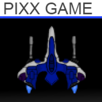

# SpacepiXX 

SpacepiXX is a popular retro style space shooter for Windows Phone.

    

You are the commander of a space ship and fight against different enemies. Enjoy the ultra smooth gameplay and collect power ups to get stronger.
But attention: Beware the angry bosses and flying asteroids!

You can get the app from the [Windows Store](http://windowsphone.com/s?appId=cbe0dfa7-2879-4c2c-b7c6-3798781fba16).

### Features
- Challenging levels
- Smooth gameplay with 60 FPS
- Online leaderboards
- 20+ power-ups
- Pixelated retro look
- 7 different kinds of laser shots

### Reviews

What did users think about this app? Here are just a few out of more than 600 reviews:

> "Didn't think the original version could be improved but it has... Awesome game!!!!!!!"
>
> _MoenchIndiana77, Deutschland_

> "I love playing this, its well old school. more c64 type shooters on the windows phone please"
>
> _DGM5000, UK_

## History

This was my first game project for Windows Phone that I started during my first semester in early 2011. It started after reading the book [XNA 4.0 Game Development by Example: Beginners Guide](https://www.packtpub.com/product/xna-4-0-game-development-by-example-beginner-s-guide/9781849690669) by _Kurt Jaegers_. After learnings the basics of XNA using this book, I then extended the very basic _Asteroid Belt Assault_ space shooter, added many features and my own pixel art, and later finally published this game in the Windows Phone store.

## License

This work is published under [MIT][mit] License.

[mit]: https://github.com/b3nk4n/spacepixx-game/blob/main/LICENSE